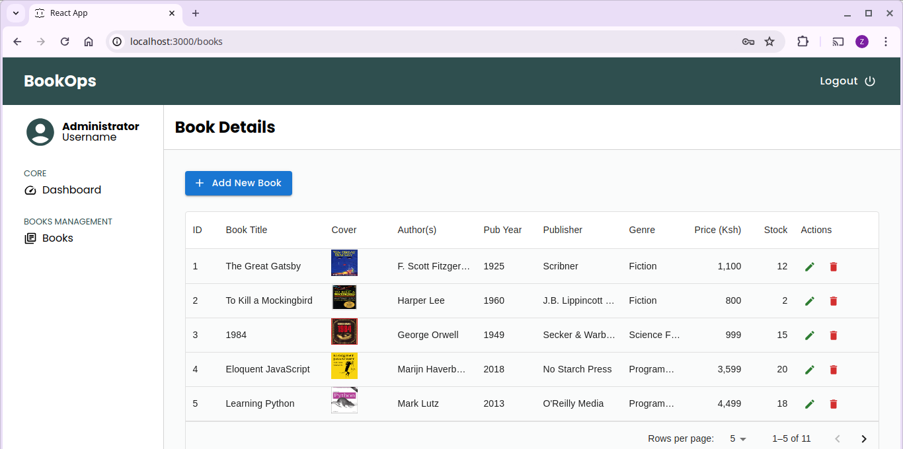

# BookOps

A Book Store management application where you can view your book store at a glance! 

## Overview

This web-based application allows the manager/owner to view all books in the store, add a book, update a book's details as well as delete a book.

## Features

As a user, you can:

- Login to the application as an administrator
- View all books available in the book store
- Sort the books by shelf price, stock quantity, buying price etc.
- Filter the books by category,supplier name, among others
- View the books due for reorders
- Add a new book
- Update a book's details
- Delete a book

## Technologies Used

1. HTML
2. CSS
3. Material UI
4. React JS

## Setup Guide

1. Clone the repo
2. Open with a code editor
3. Run 'npm install' to install all required dependencies
4. Run 'npm run server' to spin up a local server
5. Run 'npm start' to view the application in a browser

## Preview

